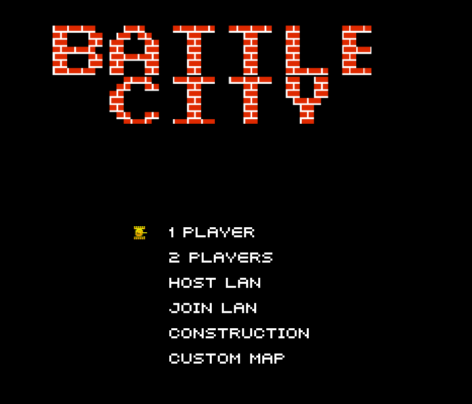
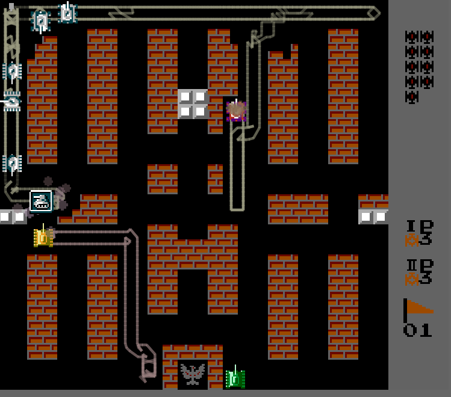
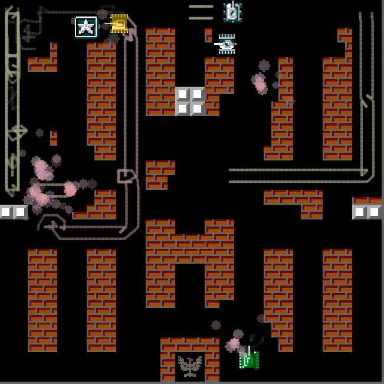
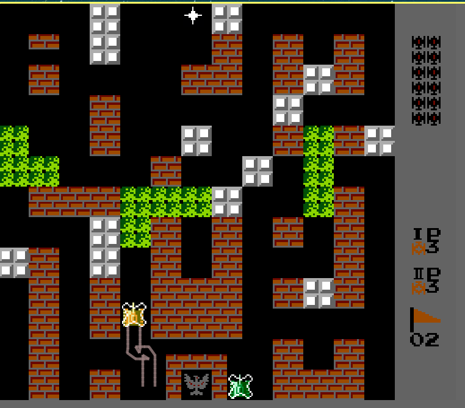
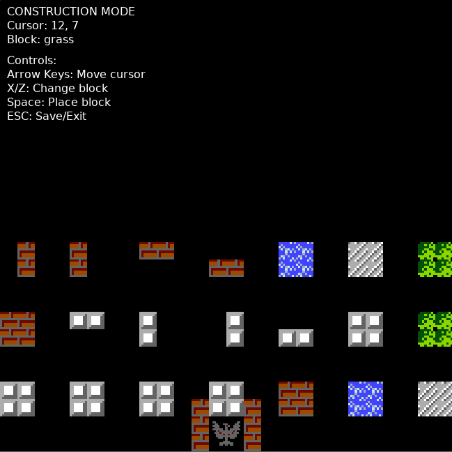

# Tank Battle

A LÖVE 2D remake of the classic NES game *Battle City*. Single-player campaign, local 2-player co-op, LAN multiplayer, and an in-game map editor.



| | |
|---|---|
|  |  |
|  |  |

## Requirements

- [LÖVE 2D 11.5](https://love2d.org/)

## Running

### Linux / macOS
```bash
love .
```
or with the AppImage:
```bash
~/path_to_appimage/love-11.5-x86_64.AppImage .
```

### Windows
Drag the project folder onto `love.exe`, or:
```cmd
"C:\Program Files\LOVE\love.exe" path\to\tank
```

## Controls

| Action | Player 1 | Player 2 |
|---|---|---|
| Move | Arrow keys | WASD |
| Fire | Space / Return | F |
| Back / Pause | Esc | — |

Title screen: `Up`/`Down` to navigate, `Return` to select. Stage select, custom map, map editor, and host/join LAN are all reachable from there.

## LAN Multiplayer

One machine hosts; the other joins by IP. Default UDP port: **22122**.

1. Host picks **HOST LAN** on the title screen.
2. Client picks **JOIN LAN**, types the host's IP, presses Return.
3. Same subnet (LAN, WiFi hotspot, etc.). Host's firewall must allow UDP/22122.

Architecture: authoritative host runs the full simulation; the client is a viewer that streams keypresses (reliable, on-change) and renders 30 Hz state snapshots (unreliable), with reliable event replication for sounds, VFX, screen shake, and score numbers.

## Map Editor

Title screen → **CUSTOM MAP** → **EDIT MAP**. Click cells to place blocks; saves go to LÖVE's per-OS save directory (`~/.local/share/love/tank/` on Linux).

## Project Layout

| File | Purpose |
|---|---|
| `main.lua` | Globals + LÖVE callbacks; delegates to modules |
| `assets.lua` | Spritesheet/quad loading |
| `audio.lua` | Sound loading, positional playback, engine FSM |
| `map.lua` | Map generation, block destruction, colliders |
| `combat.lua` | Bullets, firing, pickups, collisions |
| `entities.lua` | Player/enemy spawning, movement, pickups, shields |
| `vfx.lua` | Particles, explosions, damage numbers, camera, shake |
| `draw.lua` | All rendering |
| `title.lua` | Title screen + menus |
| `stages.lua` | Stage intro/end, progression |
| `editor.lua` | Map editor |
| `network.lua` | LAN multiplayer (lua-enet) |
| `windfield/` | Third-party physics library |

## Building Distributables

### `.love` archive (cross-platform)
```bash
zip -9 -r tank.love . -x ".*" -x "*.love" -x "stage_data/*.json" -x "dist-win/*" -x "*.zip" -x "*.exe" -x "screenshot_*.png" -x "README.md"
```

### Windows `.exe` (cross-compile from Linux)
```bash
# one-time: get the Windows LÖVE binary
wget https://github.com/love2d/love/releases/download/11.5/love-11.5-win64.zip
unzip love-11.5-win64.zip -d love-win64

# fuse: cat love.exe + game.love → game.exe
cat love-win64/love-11.5-win64/love.exe tank.love > tank.exe

# bundle with the required DLLs
mkdir -p dist-win
cp tank.exe dist-win/
cp love-win64/love-11.5-win64/*.dll dist-win/
cp love-win64/love-11.5-win64/license.txt dist-win/
zip -r tank-win64.zip dist-win/
```

The DLLs (`SDL2.dll`, `lua51.dll`, `OpenAL32.dll`, etc.) must sit next to `tank.exe`. The resulting zip runs on any 64-bit Windows with no install — `cat` is the entire "compile" step.

## Credits

Sound effects from [Pixabay](https://pixabay.com/sound-effects/):

- Coding: Claude, me
- [FoxBoyTails](https://pixabay.com/users/foxboytails-49447089/)
- [freesound_community](https://pixabay.com/users/freesound_community-46691455/)
- [Universfield](https://pixabay.com/users/universfield-28281460/)

Built with [LÖVE 2D](https://love2d.org/) and [windfield](https://github.com/a327ex/windfield).
